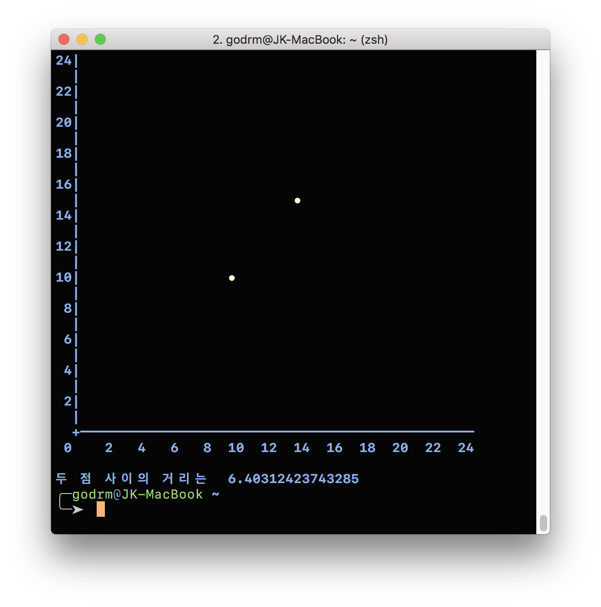

# 좌표계산기(선 길이)

---

## 기능 요구사항
- 사용자가 점에 대한 좌표 정보를 입력하는 메뉴를 구성한다.
- 좌표 정보는 괄호"(", ")"로 둘러쌓여 있으며 쉼표(,)로 x값과 y값을 구분한다.
- X, Y좌표 모두 최대 24까지만 입력할 수 있다.
- 입력 범위를 초과할 경우 에러 문구를 출력하고 다시 입력을 받는다.
- 정상적인 좌표값을 입력한 경우, 해당 좌표에 특수문자를 표시한다.
- 좌표값을 두 개 입력한 경우, 두 점을 있는 직선으로 가정한다. 좌표값과 좌표값 사이는 '-' 문자로 구분한다.
- 직선인 경우는 두 점 사이 거리를 계산해서 출력한다.

## 실행 결과
```
좌표를 입력하세요.
(10,10)-(14,15)
```

```
두 점 사이 거리는 6.403124
```

## 힌트
- 두 점 사이 거리는 `제곱근((A.x - B.x)^제곱 + (A.y - B.y)^제곱)` 공식으로 계산할 수 있다.
- 제곱근을 구하는 수학 함수는 Math.sqrt()를 활용한다.
- 테스트 코드의 경우 double일 때 근사치를 테스트하는 경우가 많다. 

### 테스트 assert 힌트
- junit은 `assertEquals(1.414, line.length(), 0.001);`과 같이 세번째 인자에 정밀도를 지정할 수 있다.
- assertj는 `assertThat(line.length()).isEqualTo(1.414, offset(0.00099));`과 같이 offset 메소드로 정밀도를 지정할 수 있다.

---
## 구현
- Position(위치) 클래스가 있다.
- Position 클래스는 int position을 가진다.
- Point(점) 클래스가 있다.
- Point 클래스는 Position x, y를 가진다. 
- Line(선) 클래스가 있다.
- Line 클래스는 Point start, end를 가진다.
- Line 클래스는 length() 메서드를 가진다. 
- length()는 `제곱근((start.x.position - end.x.position)^제곱 + (start.y.position - end.y.position)^제곱)`을 double 타입으로 반환한다.