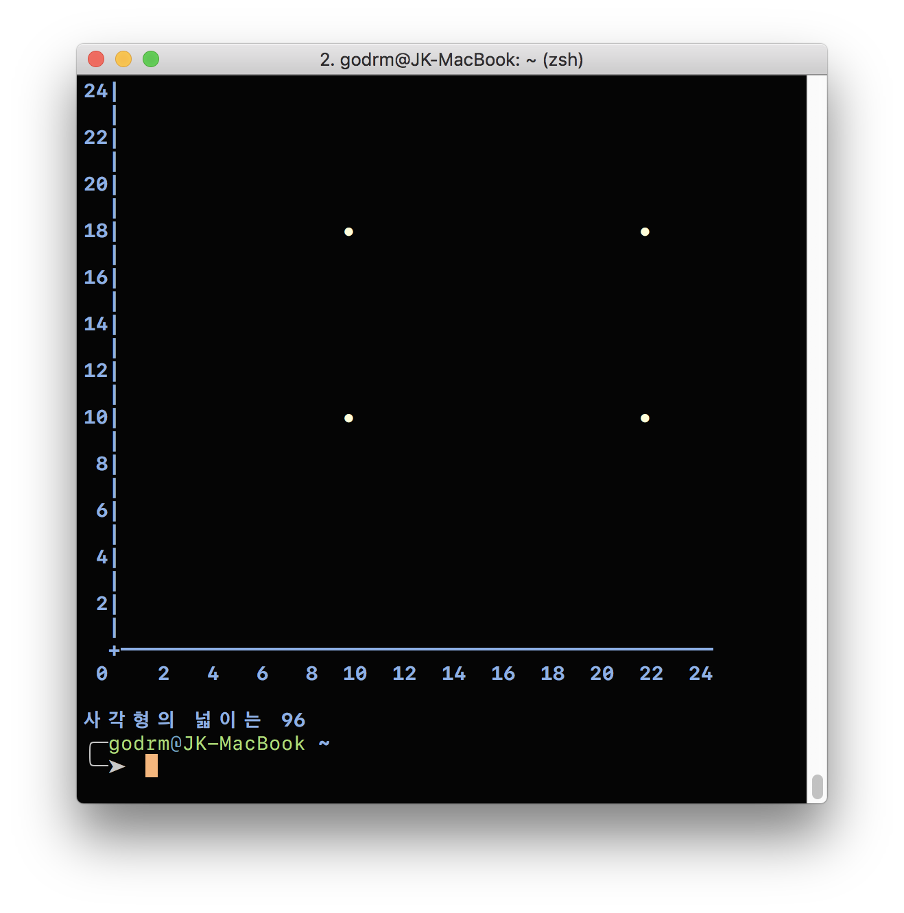

# 좌표계산기(사각형 면적)

---

## 기능 요구사항
- 좌표값을 두 개 입력한 경우, 두 점을 있는 직선으로 가정한다. 좌표값과 좌표값 사이는 '-' 문자로 구분한다.
- 좌표값을 네 개 입력한 경우, 네 점을 연결하는 사각형으로 가정한다.
  - 네 점이 뒤틀어진 사다리꼴이나 마름모는 제외하고 직사각형만 허용하도록 검사한다.
  - 사각형인 경우 사각형의 넓이를 계산해서 출력한다.

## 실행 결과
```
좌표를 입력하세요.
(10,10)-(22,10)-(22,18)-(10,18)
```

```
사각형 넓이는 96
```

## 힌트
- 사각형 면적은 width * height 방식으로 계산할 수 있다.
- Point라는 객체를 추가해 x, y 좌표를 관리하도록 한다.