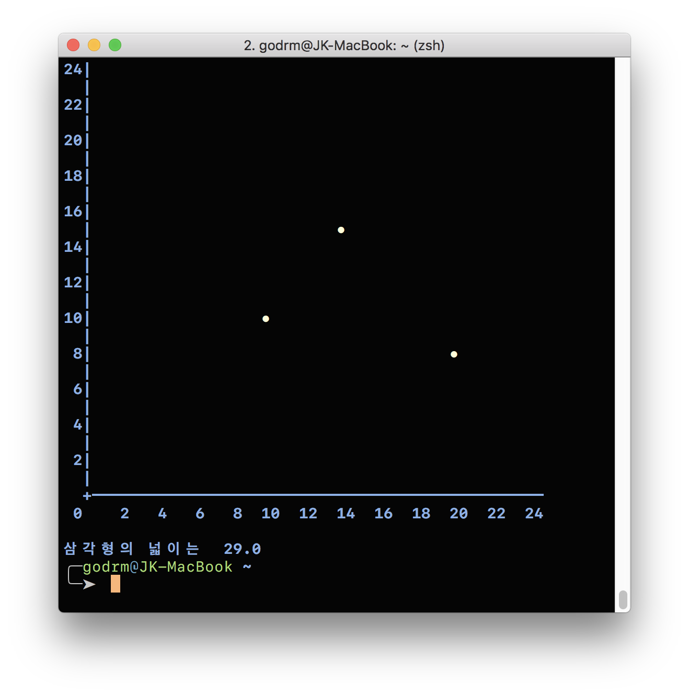

# 좌표계산기(사각형 면적)

---

## 기능 요구사항
- 좌표값을 두 개 입력한 경우, 두 점을 있는 직선으로 가정한다. 좌표값과 좌표값 사이는 '-' 문자로 구분한다.
-  좌표값을 세 개 입력한 경우, 세 점을 연결하는 삼각형으로 가정한다.
  - 삼각형인 경우 삼각형의 넓이를 계산해서 출력한다.

## 실행 결과
```
좌표를 입력하세요.
(10,10)-(14,15)-(20,8)
```

```
삼각형 넓이는 29.0
```

## 힌트
- 세 변의 길이를 알 때 삼각형의 넓이를 구하는 공식은 [헤론의 공식](https://ko.wikipedia.org/wiki/%ED%97%A4%EB%A1%A0_%EA%B3%B5%EC%8B%9D)을 이용해 구할 수 있다.
